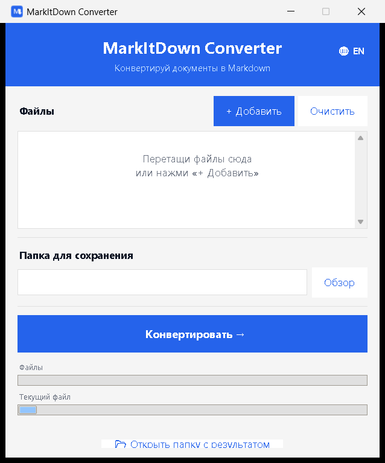

# MarkItDown Converter

Простое десктоп-приложение для Windows, которое конвертирует документы (PDF, Word, Excel, PowerPoint, изображения и др.) в **Markdown** — удобный формат для работы с ИИ (ChatGPT, Claude и т.п.).

A simple Windows desktop app that converts documents (PDF, Word, Excel, PowerPoint, images, etc.) into **Markdown** — a convenient format for working with AI (ChatGPT, Claude, etc.).

Графический интерфейс с переключателем языка **RU / EN**, перетаскиванием файлов и пакетной конвертацией. Под капотом — библиотека [`markitdown`](https://github.com/microsoft/markitdown) от Microsoft.

GUI with an **RU / EN** language switch, drag-and-drop, and batch conversion. Powered by Microsoft's [`markitdown`](https://github.com/microsoft/markitdown) library.



---

## 🇷🇺 Русский

> 👋 Привет! Я начинающий программист, и это приложение — моё хобби. Я сделал десктопную программу для конвертации файлов в Markdown, чтобы потом удобно использовать их в ИИ. Буду рад, если оно пригодится и тебе.

### Возможности
- Перетаскивание файлов в окно (drag & drop) или выбор через диалог
- Пакетная конвертация — сразу много файлов
- Прогресс по каждому файлу и в целом
- Переключатель языка интерфейса 🌐 **RU / EN** (выбор запоминается)

### Поддерживаемые форматы
PDF, Word (`.docx`), Excel (`.xlsx`, `.xls`), PowerPoint (`.pptx`, `.ppt`),
HTML, TXT, CSV, JSON, XML, ZIP, изображения (`.jpg`, `.png`, `.gif`, `.bmp`, `.webp`),
аудио (`.mp3`, `.wav`, `.m4a`).

### Установка и запуск (для обычного пользователя)
> 💡 **Python устанавливать НЕ нужно** — он уже встроен в приложение. Просто скачай и запусти.

Есть два формата сборки:
- **Один файл** (`MarkItDown Converter.exe`, режим onefile) — скачал один `.exe`, дважды кликнул, работает. Первый запуск медленнее (~10–30 с): файл распаковывается во временную папку.
- **Папка** (режим onedir) — запускается быстрее, но раздавать нужно **всю папку целиком**: рядом с `MarkItDown Converter.exe` лежит папка `_internal` с движком.

Затем:
1. Запусти `MarkItDown Converter.exe`.
2. Перетащи файлы в окно → выбери папку для сохранения → нажми **«Конвертировать»**.
   Рядом появятся файлы `.md`.

### Сборка из исходников (для разработки)
Нужен **Python 3.10+** для Windows.
```bat
:: 1. Установить зависимости и собрать .exe одной командой:
build.bat
```
Или вручную:
```bat
python -m pip install -r requirements.txt
python -m pip install pyinstaller
build.bat
```
Готовое приложение появится в папке `dist\MarkItDown Converter\`.
Чтобы поделиться с друзьями — заархивируй всю эту папку целиком.

Либо собери **один файл** (Python пользователю не нужен):
```bat
build_onefile.bat
```
Результат: `dist_onefile\MarkItDown Converter.exe` — его можно отдавать как есть.

---

## 🇬🇧 English

> 👋 Hi! I'm a beginner programmer and this app is my hobby. I built a desktop program that converts files into Markdown so they're easy to use with AI afterwards. Hope it's useful to you too.

### Features
- Drag & drop files into the window, or pick them via a dialog
- Batch conversion — many files at once
- Per-file and overall progress
- Interface language switch 🌐 **RU / EN** (your choice is remembered)

### Supported formats
PDF, Word (`.docx`), Excel (`.xlsx`, `.xls`), PowerPoint (`.pptx`, `.ppt`),
HTML, TXT, CSV, JSON, XML, ZIP, images (`.jpg`, `.png`, `.gif`, `.bmp`, `.webp`),
audio (`.mp3`, `.wav`, `.m4a`).

### Install & run (for end users)
> 💡 **You do NOT need Python installed** — it's bundled inside the app. Just download and run.

There are two build formats:
- **Single file** (`MarkItDown Converter.exe`, onefile mode) — download one `.exe`, double-click, done. First launch is slower (~10–30 s) as it unpacks to a temp folder.
- **Folder** (onedir mode) — starts faster, but you must share the **whole folder**: the `_internal` folder next to `MarkItDown Converter.exe` holds the engine.

Then:
1. Run `MarkItDown Converter.exe`.
2. Drag files into the window → choose an output folder → click **“Convert”**.
   The `.md` files appear next to it.

### Build from source (for development)
Requires **Python 3.10+** on Windows.
```bat
:: 1. Install deps and build the .exe in one command:
build.bat
```
Or manually:
```bat
python -m pip install -r requirements.txt
python -m pip install pyinstaller
build.bat
```
The finished app appears in `dist\MarkItDown Converter\`.
To share with friends, zip that whole folder.

Or build a **single file** (no Python needed on the user's machine):
```bat
build_onefile.bat
```
Result: `dist_onefile\MarkItDown Converter.exe` — shareable as-is.

---

## ⚙️ Технические детали / Tech notes
- GUI: `tkinter` + `tkinterdnd2` (drag & drop)
- Движок / engine: `markitdown[all]` (Microsoft)
- Сборка / packaging: `PyInstaller` (`--onedir --windowed`, см. `build.bat` / `build.sh`)
- Первый запуск свежесобранного `.exe` может быть медленным (~10 с): антивирус/OneDrive сканируют файлы.

## ☕ Поддержать / Support

🇷🇺 Если приложение оказалось полезным и вы хотите поддержать его дальнейшее развитие — буду благодарен за любой вклад. Это совершенно добровольно. 🙏

🇬🇧 If this app was useful and you'd like to support its further development, any contribution is appreciated — entirely optional. 🙏

- **Сеть / Network:** Ethereum (ERC-20)
- **Адрес кошелька / Wallet address:** `0x213FAEf3e8fC382954D41f492F973693025fA2F5`

> ⚠️ Перед отправкой убедитесь, что перевод осуществляется именно по сети **Ethereum (ERC-20)**.
> Before sending, make sure the transfer uses the **Ethereum (ERC-20)** network.

## 📄 Лицензия / License
MIT — см. файл [LICENSE](LICENSE).
